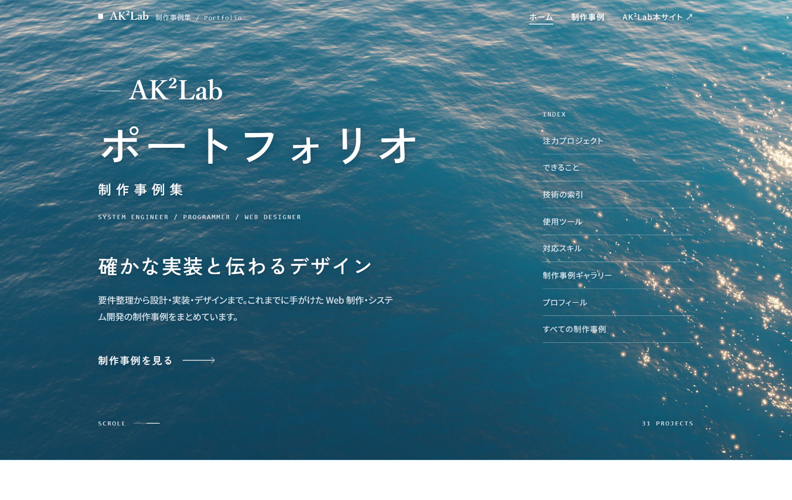

# ポートフォリオサイト

AK²Labの制作事例をまとめたポートフォリオサイト。Three.jsで描く海のヒーローとデータ駆動の事例管理を備えた、DBなし・ビルドなしのPHPサイト。

区分: 自主制作・実用

## 概要

AK²Labの制作事例をまとめるために設計・実装したポートフォリオサイト。PHPテンプレートとJSON/CSVで構成し、DB・ビルドツール・外部パッケージを使わずに動作する。トップのヒーローは、上空から見下ろしたうねる海面をThree.jsのシェーダーで描く。空と水の色・太陽の向きは閲覧時刻で朝・昼・夕に切り替わり、ドラッグで視点を回せる。照り返しは海面の傾きの広がりまで含めた式で求め、きらめきの粒として描いている。ページヘッダーではCanvas 2Dの生成水面を使っている。制作事例はキーワード検索とサービス分類・技術・領域の複合絞り込みに対応し、参考価格・担当範囲・関連リンクをJSONで管理。対応スキルと使用ツールはCSVから読み込み、分類フィルター付きで表示する。登録データは検証スクリプトでタグ、リンク、画像パスなどの整合性を確認できる。

## 制作の目的

制作事例、参考価格、担当範囲、技術情報を一か所に整理し、依頼を検討する人が制作内容を具体的に確認できるようにするため。サイト自体も既製テーマを使わず、現在の実装方針とデザインを反映している。

## 機能と特徴

- DB・ビルド・外部パッケージを使わないPHP構成（データはJSON/CSV）
- 上空から見下ろす海面をThree.jsのシェーダーで描くトップのヒーロー（閲覧時刻で朝・昼・夕を切り替え、ドラッグで視点を回せる）
- 制作事例のキーワード検索とサービス分類・技術・領域の複合絞り込み
- 参考価格・担当範囲・関連リンクを含む制作事例データ管理
- 対応スキル・使用ツールの分類フィルター付き表示
- 制作画面ギャラリーと技術別の索引
- タグ・リンク・画像パスなどを確認するデータ検証スクリプト
- 大きな見出しと余白を基調にしたデザイン、prefers-reduced-motion対応

## 使用技術

- PHP
- JavaScript
- Canvas API
- Three.js
- CSV
- CSS

## AK²Lab

- [制作事例の一覧](https://ak2lab.github.io/)
- [公式サイト](https://ak2lab.com/)
- [X](https://x.com/aidev_ak)
